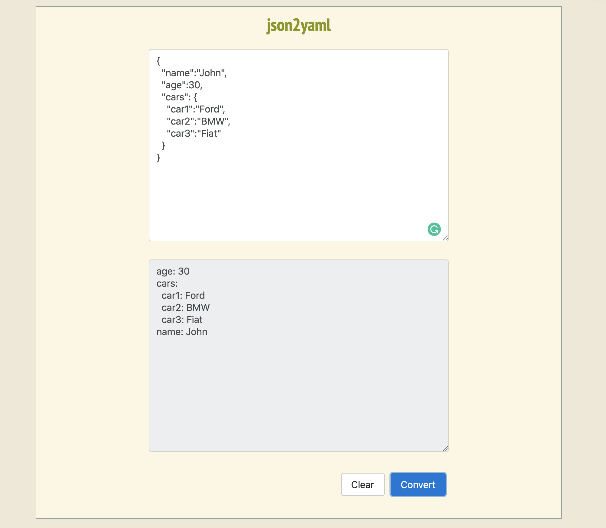

# json2yaml
> Why not? Inspired by this project https://github.com/alexrochas/pojo2json

Try the UI [json2yaml](https://json2yaml.herokuapp.com/index.html)!

## UI

Strongly based on [pojo2json](https://github.com/alexrochas/pojo2json).

## Roadmap

- yaml2json
- ~front-end~

## Meta

Alex Rocha - [about.me](http://about.me/alex.rochas) -
